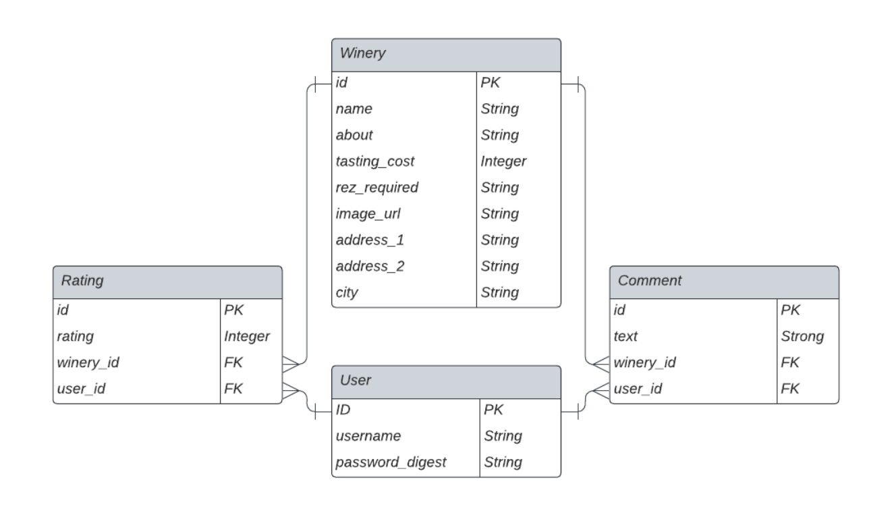

# Flatiron Phase 4 Project: VinPals                                                                            


## Description

This project allows users to discover, rate, and leave comments on wineries. A user is able to login to the site, browse wineries, add ratings or comments to wineries, edit their own ratings or comments, and view users and how they rated the wineries they've visited. 

This project uses Ruby on Rails backend to handle data stored in the databased, with a React front end for the user interface. 

The data contains 4 data tables, with User and Winery data having a many-to-many relationship via Ratings and Comments. 




## Requirements

- Ruby 2.7.4
- NodeJS (v16), and npm

## Run locally

To run this project locally; clone the respository and run the following code: 

```sh
bundle install
rails db:create
rails db:migrate
rails db:seed *
npm install --prefix client
```
 <em>*Optional</em>

You can use the following commands to run the application:

- `rails s`: run the backend on [http://localhost:3000](http://localhost:3000)
- `npm start --prefix client`: run the frontend on
  [http://localhost:4000](http://localhost:4000)


## Key Technologies Used
- React (and React Router)
- Ruby on Rails


## Future Features Roadmap

- Ability for a user to create and update a user profile, containing bio information and favorite varietals
- Filter functionality within the wineries by city
- Filter functionality within the wineries by characteristics such as average rating, price, and reservation requirements
- Sort wineries by rankings
- Search for wineries by name
- Search for users by username
- Add "friends" and see ratings and comments of friends only
